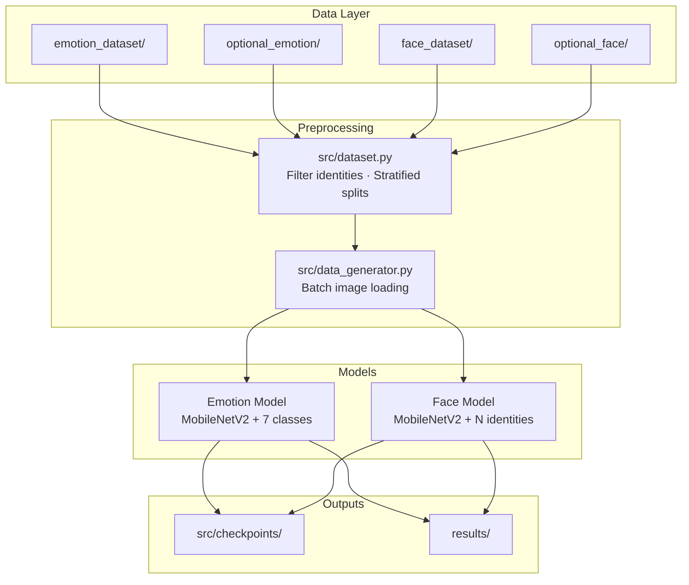

<div align="center">

# Facial Recognition & Emotion Detection

### Deep Learning · Dual CNN Pipeline · GPU-Accelerated Training

[](https://www.python.org/)
[](https://www.tensorflow.org/)
[](https://developer.nvidia.com/cuda-toolkit)
[](https://ubuntu.com/)
[](LICENSE)

<br>

**Train two independent models — recognize faces and detect emotions from a single photo.**

MobileNetV2 transfer learning · Stratified splits · Mixed precision · TensorBoard · RTX-ready

<br>

[Quick Start](#-quick-start) ·
[Features](#features) ·
[Datasets](#dataset-information) ·
[Download Data](#download-datasets-direct-links) ·
[Install](#installation-guide-step-by-step) ·
[Run](#how-to-run-the-project-step-by-step) ·
[Troubleshooting](#troubleshooting)

<br>

| Emotion Model | Face Model |
|:---:|:---:|
| 7 expressions | 150+ identities (filtered) |
| ~28K images | ~13K images (LFW-style) |
| MobileNetV2 | MobileNetV2 |

</div>

---

## About This Project

A production-style deep learning project that performs **facial recognition** (who is this person?) and **emotion detection** (what expression are they showing?) from face images.

Unlike older single-model designs, this repository trains **two separate neural networks** on **two separate datasets** — no incorrect label pairing, no 5,000-class softmax bottleneck, and evaluation only on a **held-out test set**.

| Component | Description |
|-----------|-------------|
| **Emotion Detection** | 7 classes: angry, disgust, fear, happy, neutral, sad, surprise |
| **Face Recognition** | Identity classification on a filtered subset of identities |
| **Training** | MobileNetV2 transfer learning, fine-tuning, early stopping |
| **Evaluation** | Test-set accuracy, classification report, confusion matrix |
| **Inference** | Predict emotion and/or identity on a new image |

**Built and tuned for:**

| Hardware | Software |
|----------|----------|
| NVIDIA RTX 6000 Ada (or 8 GB+ CUDA GPU) | Ubuntu 24.04 LTS |
| Multi-core CPU | Python 3.10+ |
| 16 GB+ RAM | TensorFlow 2.15 + CUDA |
| SSD storage | Mixed precision (FP16) |

Also runs on CPU-only systems (slower) and other Linux / Windows / macOS setups.

---

## Quick Start

```bash
git clone https://github.com/<your-username>/Facial_Recognition_and_Emotion_Detection_Using_Deep_Learning.git
cd Facial_Recognition_and_Emotion_Detection_Using_Deep_Learning

# Download datasets → see "Download Datasets (Direct Links)" below
# Face:   http://vis-www.cs.umass.edu/lfw/lfw.tgz
# Emotion: https://www.kaggle.com/datasets/msambare/fer2013

chmod +x scripts/setup_ubuntu.sh && ./scripts/setup_ubuntu.sh
source .venv/bin/activate
python main.py --task gpu-check
python main.py
```

---

## Table of Contents

1. [Quick Start](#-quick-start)
2. [About This Project](#about-this-project)
3. [Features](#features)
4. [System Requirements](#system-requirements)
5. [Project Architecture](#project-architecture)
6. [Dataset Information](#dataset-information)
   - [Download Datasets (Direct Links)](#download-datasets-direct-links)
7. [Model Details](#model-details)
8. [Project Structure](#project-structure)
9. [Installation Guide](#installation-guide-step-by-step)
10. [How to Run the Project](#how-to-run-the-project-step-by-step)
11. [Configuration Reference](#configuration-reference)
12. [Outputs and Results](#outputs-and-results)
13. [Inference on a Single Image](#inference-on-a-single-image)
14. [TensorBoard](#tensorboard)
15. [Troubleshooting](#troubleshooting)
16. [Improvements Over Previous Version](#improvements-over-previous-version)
17. [License](#license)

---

## Features

- Two **separate models** — no incorrect pairing between unrelated face and emotion images
- **Stratified** train / validation / test splits (70% / 15% / 15%)
- **Face identity filtering** — only people with enough images are used (viable classification)
- **Batch data loading** — images loaded per mini-batch (low RAM usage)
- **GPU + mixed precision** (FP16) for faster training on NVIDIA hardware
- **Early stopping**, learning rate reduction, and **ModelCheckpoint** (best validation accuracy)
- **TensorBoard** logging
- Optional folders for **extra datasets** (`data/optional_emotion/`, `data/optional_face/`)
- Single-image **prediction** script
- Safe **sklearn** metrics (no thousands of undefined-metric warnings)

---

## System Requirements

### Recommended (production / training)

| Component | Specification |
|-----------|----------------|
| **GPU** | NVIDIA RTX 6000 Ada (or CUDA-capable GPU with 8 GB+ VRAM) |
| **CPU** | Multi-core processor (4+ cores) |
| **RAM** | 16 GB minimum (32 GB recommended for large batches) |
| **Storage** | SSD with 10 GB+ free (dataset + models + logs) |
| **OS** | Ubuntu 24.04 LTS |
| **Python** | 3.10 or 3.11 |
| **NVIDIA Driver** | Compatible with CUDA (e.g. 550+) |
| **TensorFlow** | 2.15+ with CUDA (`tensorflow[and-cuda]`) |

### Minimum (development / CPU fallback)

| Component | Specification |
|-----------|----------------|
| **RAM** | 8 GB |
| **Python** | 3.9 – 3.11 |
| **Storage** | 5 GB free |

> **Note:** Training on CPU can take many hours per epoch. Use a GPU for practical training times.

---

## Project Architecture



### Training pipeline (per model)

1. Scan image folders and build `(path, label)` lists  
2. For **face**: keep identities with ≥ `MIN_IMAGES_PER_PERSON` photos (cap at `MAX_FACE_IDENTITIES`)  
3. Split into **train / val / test** (stratified by label)  
4. Fit **LabelEncoder** on training labels only  
5. Train with frozen backbone → **fine-tune** last layers from epoch 5  
6. Save best model (`.keras`) and label encoder (`.pkl`)  
7. Evaluate on **test** split only  

---

## Dataset Information

### Directory layout

Place your data under the `data/` folder:

```
data/
├── face_dataset/              # Required for face recognition
│   ├── person_001/
│   │   ├── photo1.jpg
│   │   ├── photo2.jpg
│   │   └── ...
│   ├── person_002/
│   └── ...
│
├── emotion_dataset/           # Required for emotion detection
│   ├── angry/
│   ├── disgust/
│   ├── fear/
│   ├── happy/
│   ├── neutral/
│   ├── sad/
│   └── surprise/
│
├── optional_face/             # Optional — merged with face_dataset
└── optional_emotion/          # Optional — merged with emotion_dataset
```

### Supported image formats

`.jpg`, `.jpeg`, `.png`, `.bmp`, `.webp`

### Emotion dataset

| Class | Folder name |
|-------|-------------|
| Angry | `angry` |
| Disgust | `disgust` |
| Fear | `fear` |
| Happy | `happy` |
| Neutral | `neutral` |
| Sad | `sad` |
| Surprise | `surprise` |

Typical size in this project: **~28,000+ images** across 7 classes.

### Face dataset

| Property | Value (typical for included data) |
|----------|-----------------------------------|
| Raw identities | 5,700+ person folders |
| Raw images | ~13,000+ |
| **After filtering** | ~150+ identities, ~4,000 images |

**Why filtering?** Most person folders contain only **1–2 images**, which is insufficient for stratified train/val/test splits and reliable softmax classification. The pipeline automatically:

1. Keeps only people with **≥ 10 images**
2. Sorts by image count and caps at **500 identities** (configurable)
3. Drops classes with too few samples for splitting

**Recommended sources:** [LFW (faces)](http://vis-www.cs.umass.edu/lfw/) · [FER2013 (emotions)](https://www.kaggle.com/datasets/msambare/fer2013)

---

### Download Datasets (Direct Links)

Use the datasets below, then organize them into the folder structure shown above.

#### Face recognition — LFW (Labeled Faces in the Wild)

| Resource | Link |
|----------|------|
| **Official download (lfw.tgz)** | [http://vis-www.cs.umass.edu/lfw/lfw.tgz](http://vis-www.cs.umass.edu/lfw/lfw.tgz) |
| **Official website** | [http://vis-www.cs.umass.edu/lfw/](http://vis-www.cs.umass.edu/lfw/) |
| **Mirror (Figshare — same dataset)** | [https://ndownloader.figshare.com/files/5976018](https://ndownloader.figshare.com/files/5976018) |
| **Funneled version (optional, aligned faces)** | [https://ndownloader.figshare.com/files/5976015](https://ndownloader.figshare.com/files/5976015) |

**After download:**

```bash
# Extract and copy into project (from project root)
tar -xzf lfw.tgz
cp -r lfw data/face_dataset
# Result: data/face_dataset/Person_Name/image.jpg
```

---

#### Emotion detection — FER2013 (7 classes)

| Resource | Link |
|----------|------|
| **Kaggle — FER2013 (recommended, folder layout)** | [https://www.kaggle.com/datasets/msambare/fer2013](https://www.kaggle.com/datasets/msambare/fer2013) |
| **Kaggle — FER2013 image folders** | [https://www.kaggle.com/datasets/astraszab/facial-expression-dataset-image-folders-fer2013](https://www.kaggle.com/datasets/astraszab/facial-expression-dataset-image-folders-fer2013) |
| **Kaggle — Original challenge data** | [https://www.kaggle.com/c/challenges-in-representation-learning-facial-expression-recognition-challenge/data](https://www.kaggle.com/c/challenges-in-representation-learning-facial-expression-recognition-challenge/data) |

> Kaggle links require a free account. Install the CLI: `pip install kaggle`, place your API key in `~/.kaggle/kaggle.json`, then:

```bash
# Example: download msambare/fer2013
kaggle datasets download -d msambare/fer2013
unzip fer2013.zip -d data/emotion_dataset
# Ensure folders are named: angry, disgust, fear, happy, neutral, sad, surprise
```

**Folder names must match exactly:**

`angry` · `disgust` · `fear` · `happy` · `neutral` · `sad` · `surprise`

---

#### Optional extra data

| Folder | Purpose |
|--------|---------|
| `data/optional_face/` | More person folders (same layout as `face_dataset`) |
| `data/optional_emotion/` | More emotion folders (same layout as `emotion_dataset`) |

---

### Data splits

| Split | Ratio | Purpose |
|-------|-------|---------|
| Train | 70% | Model training |
| Validation | 15% | Early stopping, checkpoint selection |
| Test | 15% | Final evaluation (never seen during training) |

Splits are cached in `src/checkpoints/emotion_splits.pkl` and `face_splits.pkl`.

---

## Model Details

### Backbone

| Setting | Default | Alternative |
|---------|---------|-------------|
| `BACKBONE` | `mobilenetv2` | `efficientnetb0` |

Both use **ImageNet** pretrained weights.

### Architecture (each model)

```
Input (128×128×3 RGB)
    ↓
MobileNetV2 (frozen initially)
    ↓
GlobalAveragePooling2D
    ↓
Dropout (0.4)
    ↓
Dense (256, ReLU)
    ↓
Dense (num_classes, softmax)
```

### Training strategy

| Stage | Description |
|-------|-------------|
| **Phase 1** | Backbone frozen; train classification head |
| **Phase 2** | From epoch 5: unfreeze last 30 backbone layers, lower LR (`1e-4`) |
| **Callbacks** | EarlyStopping (patience 7), ReduceLROnPlateau, ModelCheckpoint, TensorBoard |
| **Mixed precision** | Enabled on GPU (`mixed_float16`) for speed |

### Loss and optimizer

- **Loss:** Categorical cross-entropy  
- **Optimizer:** Adam  
- **Metrics:** Accuracy  

---

## Project Structure

```
Facial_Recognition_and_Emotion_Detection_Using_Deep_Learning/
│
├── main.py                      # Main entry point (train / eval / GPU check)
├── requirements.txt             # Python dependencies
├── README.md                    # This file
├── .gitignore
│
├── scripts/
│   └── setup_ubuntu.sh          # Automated Ubuntu environment setup
│
├── data/                        # Datasets (not always in Git — add locally)
│   ├── face_dataset/
│   ├── emotion_dataset/
│   ├── optional_face/
│   └── optional_emotion/
│
├── results/                     # Generated plots and reports
│   ├── emotion_classification_report.txt
│   ├── face_classification_report.txt
│   ├── emotion_training_history.png
│   ├── face_training_history.png
│   └── *_confusion_matrix.png
│
└── src/
    ├── __init__.py
    ├── config.py                # All hyperparameters and paths
    ├── dataset.py               # Scanning, filtering, stratified splits
    ├── data_generator.py        # Keras Sequence for batch loading
    ├── model.py                 # Build classifier, fine-tune backbone
    ├── train.py                 # train_emotion_model(), train_face_model()
    ├── evaluate.py              # Test-set evaluation and reports
    ├── predict.py               # Single-image inference
    ├── preprocess.py            # Legacy full-RAM loader (optional)
    ├── utils.py                 # Training history plots
    ├── gpu_utils.py             # CUDA and mixed precision setup
    ├── callbacks.py             # Fine-tune-at-epoch callback
    └── checkpoints/             # Saved models, encoders, splits, logs
        ├── emotion_model.keras
        ├── face_model.keras
        ├── emotion_label_encoder.pkl
        ├── face_label_encoder.pkl
        ├── emotion_splits.pkl
        ├── face_splits.pkl
        └── logs/                # TensorBoard event files
```

---

## Installation Guide (Step-by-Step)

### Step 1 — Clone the repository

```bash
git clone https://github.com/<your-username>/Facial_Recognition_and_Emotion_Detection_Using_Deep_Learning.git
cd Facial_Recognition_and_Emotion_Detection_Using_Deep_Learning
```

Or download the ZIP from GitHub and extract it.

---

### Step 2 — Install NVIDIA driver (Ubuntu + GPU)

Skip this section if you train on CPU only.

```bash
# Check if GPU is visible
nvidia-smi
```

If `nvidia-smi` fails, install drivers (example):

```bash
sudo apt update
sudo apt install -y nvidia-driver-550
sudo reboot
```

After reboot, run `nvidia-smi` again and confirm your **RTX 6000 Ada** (or other GPU) is listed.

---

### Step 3 — Install system packages (Ubuntu 24.04)

```bash
sudo apt update
sudo apt install -y python3 python3-venv python3-pip git
```

---

### Step 4 — Create a virtual environment

```bash
cd Facial_Recognition_and_Emotion_Detection_Using_Deep_Learning
python3 -m venv .venv
source .venv/bin/activate
```

On Windows (PowerShell):

```powershell
python -m venv .venv
.venv\Scripts\activate
```

---

### Step 5 — Install Python dependencies

**Option A — Automated (Ubuntu)**

```bash
chmod +x scripts/setup_ubuntu.sh
./scripts/setup_ubuntu.sh
source .venv/bin/activate
```

**Option B — Manual**

```bash
pip install --upgrade pip wheel
pip install -r requirements.txt
```

`requirements.txt` includes `tensorflow[and-cuda]>=2.15` for GPU support on Linux.

---

### Step 6 — Download and add datasets

1. Download datasets using the [direct links](#download-datasets-direct-links) above.
2. Extract **LFW** into `data/face_dataset/` (one folder per person).
3. Extract **FER2013** into `data/emotion_dataset/` (one folder per emotion).
4. (Optional) Add more data under `data/optional_face/` and `data/optional_emotion/`.

Verify folders exist:

```bash
ls data/face_dataset | head
ls data/emotion_dataset
```

Expected emotion folders: `angry`, `disgust`, `fear`, `happy`, `neutral`, `sad`, `surprise`.

See [Dataset Information](#dataset-information) for full layout and filtering rules.

---

### Step 7 — Verify GPU and TensorFlow

```bash
source .venv/bin/activate
python main.py --task gpu-check
```

Expected output (GPU system):

```
TensorFlow: 2.15.x
Built with CUDA: True
GPUs: [PhysicalDevice(name='/physical_device:GPU:0', device_type='GPU')]
```

If no GPU is listed, training will still work on CPU but will be much slower.

---

## How to Run the Project (Step-by-Step)

### Step 1 — Activate the environment

Every new terminal session:

```bash
cd Facial_Recognition_and_Emotion_Detection_Using_Deep_Learning
source .venv/bin/activate
```

---

### Step 2 — (First run) Build data splits

Splits are created automatically on first training. To force rebuild after adding images:

```bash
python main.py --rebuild-splits --skip-eval --task emotion
```

Or rebuild during full training with `--rebuild-splits`.

---

### Step 3 — Train both models (recommended full pipeline)

```bash
python main.py
```

This will:

1. Train the **emotion** model  
2. Train the **face** model  
3. Save training history plots to `results/`  
4. Evaluate both models on the **test** set  
5. Save classification reports to `results/`  

**Estimated time (RTX 6000 Ada):** roughly **1–3 hours** total (depends on early stopping).  
**Estimated time (CPU):** many hours — not recommended for full training.

---

### Step 4 — Train one model at a time (optional)

**Emotion only:**

```bash
python main.py --task emotion
```

**Face only:**

```bash
python main.py --task face
```

---

### Step 5 — Train without evaluation (faster iteration)

```bash
python main.py --skip-eval
```

Evaluate later:

```bash
python main.py --task eval
```

---

### Step 6 — Evaluate existing models only

Requires saved files in `src/checkpoints/`:

- `emotion_model.keras`
- `face_model.keras`
- `emotion_label_encoder.pkl`
- `face_label_encoder.pkl`

```bash
python main.py --task eval
```

---

### Step 7 — View results

| File | Description |
|------|-------------|
| `results/emotion_classification_report.txt` | Precision, recall, F1 per emotion |
| `results/face_classification_report.txt` | Metrics per identity |
| `results/emotion_training_history.png` | Train/val accuracy and loss |
| `results/face_training_history.png` | Train/val accuracy and loss |
| `results/emotion_confusion_matrix.png` | Test confusion matrix (7 classes) |

---

### Command reference

| Command | Description |
|---------|-------------|
| `python main.py` | Train emotion + face, plot history, evaluate |
| `python main.py --task emotion` | Train and evaluate emotion model only |
| `python main.py --task face` | Train and evaluate face model only |
| `python main.py --task eval` | Evaluate saved models on test set |
| `python main.py --task gpu-check` | Print TensorFlow and GPU information |
| `python main.py --rebuild-splits` | Recompute cached train/val/test splits |
| `python main.py --skip-eval` | Train only, skip test evaluation |
| `python main.py --skip-train` | Same as `--task eval` when models exist |

---

## Configuration Reference

Edit `src/config.py` to tune behavior:

| Parameter | Default | Description |
|-----------|---------|-------------|
| `IMAGE_SIZE` | `(128, 128)` | Input resolution |
| `BACKBONE` | `mobilenetv2` | `mobilenetv2` or `efficientnetb0` |
| `MIN_IMAGES_PER_PERSON` | `10` | Minimum photos per identity (face) |
| `MAX_FACE_IDENTITIES` | `500` | Max number of people to train |
| `MIN_SAMPLES_PER_CLASS` | `10` | Minimum samples per class for splits |
| `BATCH_SIZE_EMOTION` | `64` | Emotion mini-batch size |
| `BATCH_SIZE_FACE` | `32` | Face mini-batch size |
| `EPOCHS` | `20` | Maximum epochs (early stopping may stop sooner) |
| `VALIDATION_SPLIT` | `0.15` | Fraction for validation |
| `TEST_SPLIT` | `0.15` | Fraction for test |
| `LEARNING_RATE` | `1e-3` | Initial Adam learning rate |
| `FINE_TUNE_AT_EPOCH` | `5` | Epoch to unfreeze backbone |
| `FINE_TUNE_LR` | `1e-4` | Learning rate after unfreeze |
| `USE_MIXED_PRECISION` | `True` | FP16 on GPU |
| `EARLY_STOPPING_PATIENCE` | `7` | Stop if val accuracy stalls |

---

## Outputs and Results

### Checkpoints (`src/checkpoints/`)

| File | Description |
|------|-------------|
| `emotion_model.keras` | Best emotion model (validation accuracy) |
| `face_model.keras` | Best face model |
| `emotion_label_encoder.pkl` | Maps class index → emotion name |
| `face_label_encoder.pkl` | Maps class index → person ID |
| `emotion_splits.pkl` | Cached paths for train/val/test |
| `face_splits.pkl` | Cached paths for train/val/test |
| `logs/` | TensorBoard event logs |

### Results (`results/`)

Generated after training and evaluation. Safe to delete and regenerate.

---

## Inference on a Single Image

After training, predict on a new face image:

```bash
python -m src.predict path/to/your/image.jpg
```

Example output:

```
Emotion: happy (87.32%)
Identity: person_042 (62.15%)
```

**Options:**

```bash
# Emotion only
python -m src.predict image.jpg --emotion-only

# Face identity only
python -m src.predict image.jpg --face-only
```

---

## TensorBoard

Monitor training in real time:

```bash
source .venv/bin/activate
tensorboard --logdir src/checkpoints/logs
```

Open the URL shown (usually `http://localhost:6006`) in a browser.

---

## Troubleshooting

### `nvidia-smi` not found or GPU not detected

- Install NVIDIA drivers and reboot.  
- Reinstall TensorFlow with CUDA: `pip install "tensorflow[and-cuda]>=2.15"`.  
- Run `python main.py --task gpu-check`.

### `CUDA out of memory`

Lower batch sizes in `src/config.py`:

```python
BATCH_SIZE_EMOTION = 32
BATCH_SIZE_FACE = 16
```

### `No samples found for task 'face'`

- Ensure `data/face_dataset/` exists and contains person subfolders.  
- Each person needs at least **10 images** (default).  
- Lower `MIN_IMAGES_PER_PERSON` only if you understand split quality may degrade.

### `ValueError: least populated class...`

- Some classes have too few images for stratified splitting.  
- Increase `MIN_IMAGES_PER_PERSON` or add more images per person/emotion.

### Training is very slow

- Confirm GPU is used (`gpu-check`).  
- Increase `BATCH_SIZE_*` if VRAM allows.  
- Use `--task emotion` or `--task face` to train one model at a time.

### Old `.h5` model does not load

This version uses **separate** `.keras` models. Retrain with `python main.py` — old combined multi-task checkpoints are not compatible.

### Added new images to `data/`

```bash
python main.py --rebuild-splits
```

### ModuleNotFoundError

```bash
source .venv/bin/activate
pip install -r requirements.txt
```

---

## Improvements Over Previous Version

| Issue (old) | Fix (current) |
|-------------|---------------|
| Single VGG16 with 5,749-class face head | Two MobileNetV2 models |
| Face image *i* paired with emotion *i* | Independent datasets |
| All images loaded into RAM | Batch `ImageSequence` generator |
| Evaluation on training data | 15% held-out **test** set |
| ~50 min/epoch on CPU | GPU + mixed precision + smaller backbone |
| sklearn warnings for thousands of classes | Reports only on classes present in test |
| `zsh: terminated` during eval | Lighter eval; no 5,749×5,749 confusion matrix |

---

## License

This project is provided for **academic and educational use**. You may modify and distribute it for learning and research purposes. Add your own license file if you publish formally on GitHub.

---

## Acknowledgments

- **MobileNetV2** / **EfficientNet** — Keras Applications (ImageNet weights)  
- **TensorFlow** — training and inference  
- **scikit-learn** — stratified splits and metrics  

---

## Quick Reference Card

```bash
# 1. Download data (see links above)
# Face:  http://vis-www.cs.umass.edu/lfw/lfw.tgz
# Emotion: https://www.kaggle.com/datasets/msambare/fer2013

# 2. Setup (once)
./scripts/setup_ubuntu.sh && source .venv/bin/activate

# 3. Full run
python main.py --task gpu-check
python main.py

# 4. Predict
python -m src.predict data/emotion_dataset/happy/some_image.jpg
```

---

<div align="center">

**If this project helped you, star the repository on GitHub.**

For bugs or setup help, open an [Issue](https://github.com/<your-username>/Facial_Recognition_and_Emotion_Detection_Using_Deep_Learning/issues) with your OS, GPU, and error log.

</div>
